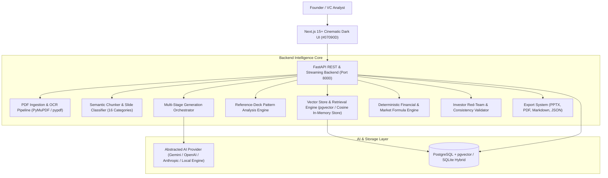

# VENTUREFORGE AI ⚡
### Raw Idea → Investor-Ready Pitch Intelligence

**VentureForge AI** is a production-grade venture intelligence platform that transforms rough startup concepts and uploaded reference pitch decks into a structured, evidence-grounded, fully editable **10-slide investor pitch blueprint** in minutes.

---

## 🏛 System Architecture



---

## 🚀 Key Platform Features

1. **Multi-PDF Document Ingestion Pipeline**:
   - Accepts 10+ reference pitch decks (drag-and-drop).
   - High-throughput page segmentation, text parsing, OCR fallback layer, and 16-category classification (`problem`, `solution`, `tam_sam_som`, `business_model`, `competition`, `gtm`, `team`, `financials`, `traction`, `funding`, etc.).
   - Semantic chunking with sliding window and metadata tagging.

2. **Reference-Grounded RAG Intelligence**:
   - 384-dimensional dense vector embeddings with diversity-preserving retrieval (max 2 chunks per document).
   - Grounded citations linking slide recommendations back to source pages in reference pitch decks.

3. **10-Slide Pitch Generation Framework**:
   - **Slide 01**: Problem (Pain funnel, cost of delay, status quo friction).
   - **Slide 02**: Solution (Value proposition, 3-pillar product transformation, why now).
   - **Slide 03**: Market Size (Bottom-up TAM / SAM / SOM with deterministic multiplier arithmetic).
   - **Slide 04**: Business Model (Tiered pricing grid, gross margin, expansion flywheel).
   - **Slide 05**: Competitive Landscape (2x2 positioning quadrant, direct/indirect competitors).
   - **Slide 06**: Go-To-Market (3-phase GTM timeline: 0-6mo, 6-18mo, 18-36mo, channel leverage).
   - **Slide 07**: Team (Founder pedigree, unfair technical advantage, missing key hires).
   - **Slide 08**: Financial Projections (Deterministic 5-year forecast, revenue, COGS, EBITDA, burn/runway).
   - **Slide 09**: Traction & Validation (Milestone velocity, active pilots, LOIs or pre-traction proof).
   - **Slide 10**: Funding Ask (Cap-table allocation donut, 24-month runway unlocks).

4. **Live 3-Pane Blueprint Editor**:
   - Left: 10-slide tree navigation with real-time completeness scores.
   - Center: Inline-editable canvas with claim confidence tags (`Founder Provided`, `Reference Pattern`, `AI Inference`, `Needs Validation`, `Confirmed`).
   - Right: AI Copilot sidebar (*Improve Slide*, *Make Investor-Friendly*, *Add Metrics*, *Challenge Assumptions*, *What Would a VC Ask?*).

5. **Formula-Backed Financial & Market Calculators**:
   - $\text{TAM} = \text{Target Customers} \times \text{Annual Spend}$
   - $\text{SAM} = \text{Reachable \%} \times \text{TAM}$
   - $\text{SOM} = \text{Penetration \%} \times \text{SAM}$
   - 5-Year Financial Forecasts with dynamic Recharts visualizations and live recalculation on parameter adjustment.

6. **Investor Red Team & Cross-Slide Integrity**:
   - 10-dimension partner readiness score (0-100).
   - Identifies critical narrative weak spots, red flags, and tough VC partner questions with suggested answers.
   - Cross-slide consistency validator (e.g. Enterprise ICP vs low ACV check, SOM target vs sales capacity check, runway math check).

7. **Multi-Format Professional Exports**:
   - 16:9 Widescreen PowerPoint (`.pptx`) slide deck.
   - Printable Executive Summary Memo (`.pdf`).
   - GitHub Markdown Blueprint (`.md`).
   - Structured JSON Schema (`.json`).

8. **Pre-Seeded Demo Startup**:
   - **AquaSentinel AI** (Municipal water infrastructure AI, pre-loaded with 12 reference decks, financial models, and full 10-slide blueprint).

---

## 🛠 Tech Stack

- **Frontend**: Next.js 15+ (App Router), React 19, TypeScript, Tailwind CSS, Lucide Icons, Framer Motion, Recharts.
- **Backend**: FastAPI, Python 3.11+, SQLAlchemy async, aiosqlite, PyMuPDF (`fitz`), pypdf, python-pptx, reportlab.
- **Storage & Vector Store**: PostgreSQL + pgvector (production) / SQLite Hybrid Vector Store (zero-dependency local dev).
- **AI Abstraction**: Modular AI provider supporting Gemini, OpenAI, Anthropic, and localized high-fidelity venture deterministic AI.

---

## ⚡ Quickstart Guide

### Prerequisites
- Node.js 18+ & npm
- Python 3.10+ & virtualenv / `uv`

### 1. Backend Setup & Startup
```bash
# Create and activate Python virtual environment
python3 -m venv .venv
source .venv/bin/activate

# Install dependencies
pip install -r apps/api/requirements.txt greenlet pytest-asyncio

# Run backend API server (runs at http://127.0.0.1:8000)
cd apps/api
uvicorn app.main:app --host 0.0.0.0 --port 8000 --reload
```

### 2. Frontend Setup & Startup
```bash
# In a new terminal window:
cd apps/web

# Install dependencies
npm install

# Start Next.js development server (runs at http://localhost:3000)
npm run dev
```

### 3. Docker Deployment (Optional)
```bash
docker compose up --build
```

---

## 🧪 Testing Suite

Run all automated unit and integration tests:
```bash
source .venv/bin/activate
PYTHONPATH=apps/api pytest apps/api/tests -v
```

Test coverage includes:
- PDF text & metric extraction
- 16-category slide classification
- Bottom-up TAM/SAM/SOM calculations
- 5-year financial projection model & runway math
- Vector embedding generation & cosine similarity retrieval
- API health check, project creation, slide updates, and red-team execution

---

## 📜 API Documentation

When the backend is running, explore interactive Swagger API docs at:
`http://127.0.0.1:8000/docs`

Key endpoints:
- `GET /api/projects` - List all projects with readiness scores
- `POST /api/projects` - Create project & trigger generation orchestrator
- `GET /api/projects/:id/pitch` - Get complete 10-slide pitch blueprint
- `PUT /api/slides/:id` - Inline autosave slide updates
- `POST /api/slides/:id/copilot` - Execute targeted AI copilot tools
- `POST /api/references/upload` - Multi-PDF reference deck uploader
- `GET /api/analytics/financial/:project_id` - 5-year financial model & TAM/SAM/SOM
- `POST /api/projects/:id/investor-red-team` - 10-dimension investor red team evaluation
- `GET /api/export/:project_id/pptx` - Download 16:9 PowerPoint deck
